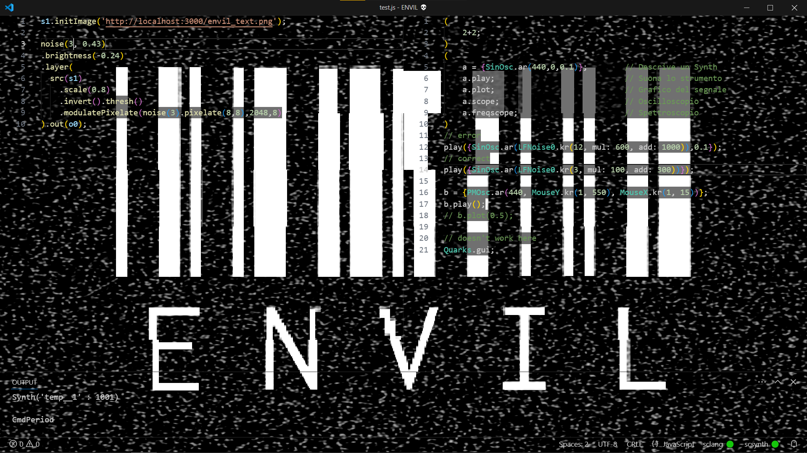
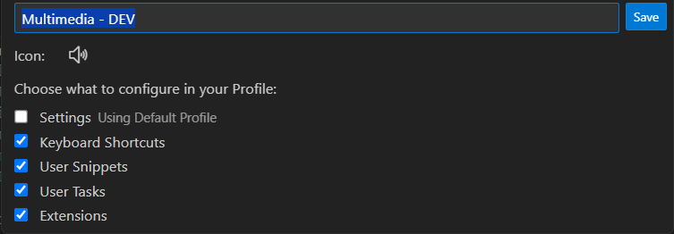

<div align="center">

# ENVIL 💀

</div>



ENVIL is a [Visual Studio Code](https://code.visualstudio.com/) extension which provides a A/V live-coding environment using [SuperCollider](https://supercollider.github.io/) and [Hydra](https://hydra.ojack.xyz/).

This setup provides every convenient feature of vscode, overlaying it on top of your favorite browser.

## Requirements

- [SuperCollider](https://supercollider.github.io/downloads)
- Any [Chromium based](https://en.wikipedia.org/wiki/Chromium_(web_browser)#Browsers_based_on_Chromium) Web Browser

## Getting started

### ENVIL setup

1. Install this vscode extension
   - You may be prompted to install the HyperScope and APC Customie UI ++ vscode extensions, allow it.
2. Open the Command Palette (Mac: <kbd>⌘</kbd>+<kbd>Shift</kbd>+<kbd>P</kbd>, Windows: <kbd>Ctrl</kbd>+<kbd>Shift</kbd>+<kbd>P</kbd>)
3. Type `Envil: Open environment` to enable ENVIL commands (vscode restart required)
4. Setup the environment:
   - Now full-screen mode cannot be used into vscode due to some tweaks in the electron configuration
   - Overlap the transparent vscode window on the browser, leaving it slightly visible resizing vscode
   - Set the browser to full-screen mode and switch back to the vscode window
5. You can close the ENVIL environment using the `Envil: Close environment` command (vscode restart required)

### HYDRA
1. Create a JavaScript file inserting a hydra script and evaluate it using the `Envil: Evaluate - Hydra` command

### SUPERCOLLIDER

1. Start sclang interpreter using the `Envil: Start/Stop SCLang - Supercollider` command or the `sclang ⭕` toggle in the status bar
   - This command will automatically boot the scsynth server
   - In the Output panel you can select the channel ***ENVIL - SC PostWindow*** to check the supercollider PostWindow logs
   - <ins>WARNING</ins>: the sclang and scsynth startup may be delayed or fail due to SW like Windows Defender. In this case try to restart sclang or check SC PostWindow logs for more informations
2. Create a SCD file inserting a supercollider script and evaluate it using the `Envil: Evaluate - Supercollider` command
3. To Hush the supercollider server use the `Envil: Hush - Supercollider` command
4. (*optional*) Configure the location of your sclang instance in your vscode *'settings.json'*:
   - example: `"envil.supercollider.sclang.cmd": "/Applications/SuperCollider.app/Contents/MacOS/sclang"`

## Features

### ENVIL

- Open the environment (vscode restart required)
  - Configures vscode to make it transparent
  - Opens your default browser to the local hydra server
  - Enables the use of the following Hydra/Supercollider features
- Close the environment (vscode restart required)
  - Removes ENVIL vscode configuration
- Update the WORKSPACE *'settings.json'* to fine-tune your vscode UI adding/updating/removing your desired property
- Use vscode Snippets
  - Create a '*snippets.code-snippets*' file inside the '.vscode' WORKSPACE folder
  - Add any snippet you want want to use in your live-coding setup
  - Type the snipper prefix and hit TAB in order to insert the snippet code

### HYDRA

- Evaluate `hydra` code in a JS file
  - Use `;` to delimit every hydra command you want to sequentially evaluate
  - Use `local/files` as base path to serve any local file from a folder named **public** inside your *vscode workspace folder*
  - Use `//` to add comments in your code
  ```javascript
  // 1. variable evaluation
  feedbackIntensity = .7;

  // 2. source initialization
  s1.initImage('local/files/my_image.png');

  // 3. script evaluation
  src(o0)
    .colorama(feedbackIntensity/10)
    // .modulatePixelate(osc())
    .scale(.96)
    .layer(noise().luma(.1))
    .out();
  ```

### SUPERCOLLIDER

- Handle `sclang` and `scsynth` startup/shutdown using
  - Dedicated commands
  - Dedicated status bar toggles
- Evaluate `supercollider` code in a SC/SCD file
  1. Selected text
  2. Regions between parentheses `( )`
  3. Current line where the cursor is placed
- Hush the server
- The interpreter evaluated lines are highlighted
- Sync hydra from supercollider code sending OSC messages
```javascript
// Define an OSC sender
~oscSend = NetAddr.new("localhost", 3002);
// Define a function to send OSC messages
~sendToHydra = { |command|
    ~oscSend.sendMsg("/hydra", command);
};
// Example: send a command to Hydra
~sendToHydra.value("osc(10, 0.1, 1).out()");
```

## Troubleshooting

### vscode doesn't become transparent

1. Use the `Enable Apc extension` command to re-enable APC Customize UI++, especially useful after a vscode update
2. Check the APC Customize UI++ properties inside the GLOBAL *'settings.json'* configuration file using the `Open User Settings (JSON)`:
   - if the file has some unsaved changes save them (envil may conflict writing properties with the APC Customize UI++ extension) and try to close and re-open envil environment
   - if you use vscode profiles make sure that your profile is configured so that it doesn't sync the settings
  
   - make sure the APC Customize UI++ extension properties are present inside the GLOBAL *'settings.json'* file and not inside a specific profile settings configuration file. The typical paths for the GLOBAL configuration file are:
     - WIN: *C:\Users\<Your Username>\AppData\Roaming\Code\User\settings.json*
     - MAC: */Users/\<Your Username>/Library/Application Support/Code/User/settings.json*
     - LINUX: */home/\<Your Username>/.config/Code/User/settings.json*

### errors with envil installation or commands

1. Use envil extension having an opened folder in the vscode workspace
2. Check your GLOBAL *'settings.json'* configuration file using the `Open User Settings (JSON)` (see point 2 in the previous section)
3. There may be some issues related to admin permissions. Check the [APC Customize UI++ extension troubleshooting page](https://github.com/drcika/apc-extension/blob/production/README.md#troubleshooting-extension-issues)

## Development Guide

1. Clone repository.
2. Run `npm install` in repo root at the command line.
3. Open `extension.js` in vscode and press `F5`. Select the option to run the "Extension Development Host."
4. You may be prompted to install the HyperScope and APC Customie UI ++ vscode extensions, allow it.

This extension has been tested in Windows 10 Home only.

## Credits

All the starting Supercollider code comes from the [scvsc](https://github.com/alexander-daniel/scvsc).